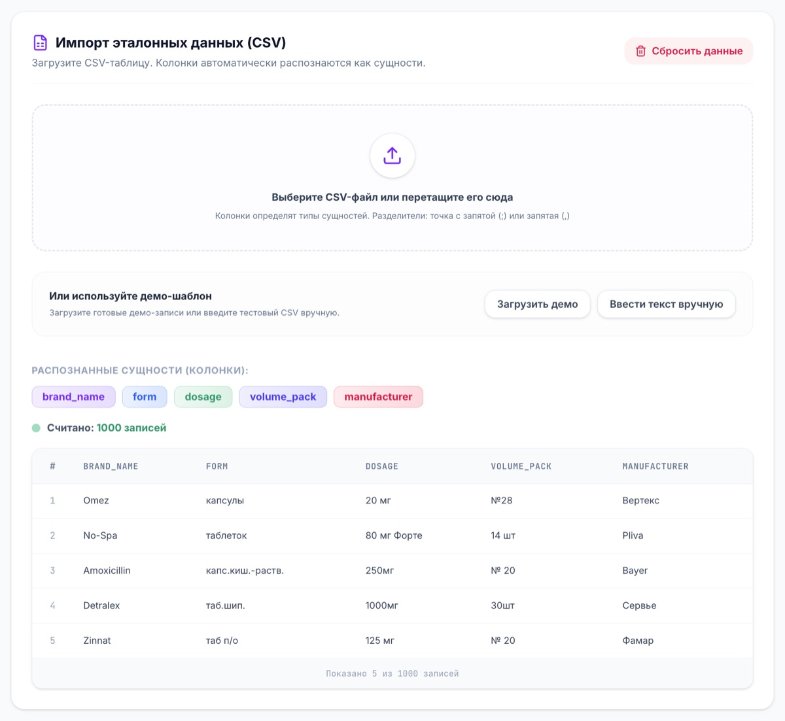
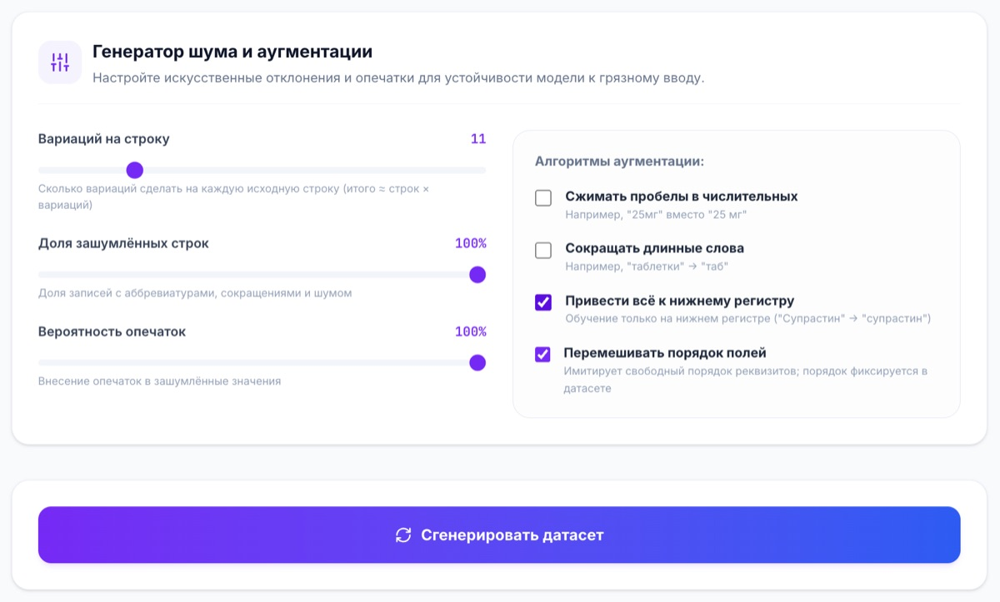
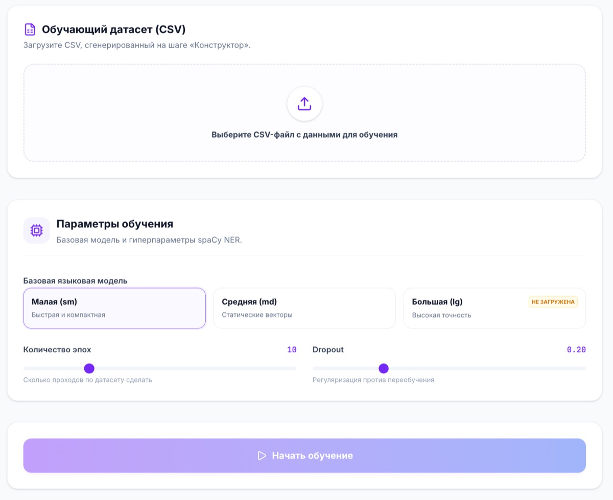
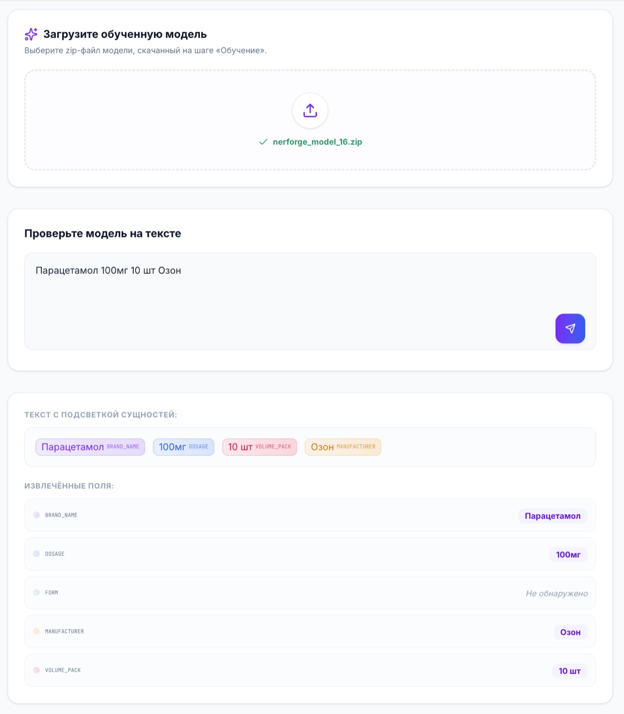

# NERForge

**Универсальный конструктор NER-моделей для разбиения «грязных» строк на поля.**

Поставщики и партнёры присылают данные хаотично: `капсулы 10 шт Вольтарен 12.5мг`,
`Вольтарен Экспресс таб №20 25мг`. NERForge учит модель вытаскивать из такой строки
структурированные поля (бренд, форма, дозировка, упаковка — или любые ваши колонки)
и делает это **без программирования и без ручной разметки**.

Решение **универсальное**: метки берутся из колонок вашего CSV, домен не зашит
(аптеки, адреса, счета-фактуры — что угодно).

---

## Какие задачи решает

- Превращает таблицу эталонных данных в обученную NER-модель.
- Сам генерирует обучающую выборку и «пачкает» её (опечатки, сокращения, убранные
  пробелы, перемешанный порядок) — чтобы модель была устойчива к реальному мусору.
- Позволяет проверить модель на любых примерах прямо в браузере.

---

## Как это работает — флоу из 3 шагов

1. **Конструктор.** Загружаешь CSV с эталонными колонками (бренд, форма, дозировка…),
   задаёшь **сколько вариаций сделать на каждую строку** и настройки шума (опечатки,
   сокращения, перемешивание порядка), жмёшь «Сгенерировать» — скачиваешь готовый
   обучающий CSV. Например, 500 строк × 5 вариаций = 2500 строк.
2. **Обучение.** Загружаешь этот CSV, выбираешь базовую модель (sm/md/lg) и
   гиперпараметры, жмёшь «Начать обучение». Прогресс идёт в реальном времени;
   на выходе — кнопка «Скачать модель» (zip).
3. **Тестирование.** Загружаешь файл модели, вводишь любой текст — видишь разбивку
   по полям с подсветкой сущностей.

Поток **файловый**: между шагами артефакты передаются файлами. Сервер ничего не
накапливает (хранится только последний результат), базы данных нет.

---

## Скриншоты

### 1. Загрузка эталонных данных


Загрузите CSV с колонками-сущностями. Сервис сразу распознаёт их как метки и показывает предпросмотр строк — убедитесь, что данные считались правильно.

### 2. Конструктор шума и аугментации


Настройте, сколько вариаций делать на каждую строку и какие искажения добавлять: опечатки, сокращения, нижний регистр, перемешивание порядка полей. Чем разнообразнее выборка — тем устойчивее модель к «грязному» вводу.

### 3. Обучение модели


Загрузите сгенерированный CSV, выберите базовую языковую модель spaCy (sm / md / lg) и гиперпараметры. Обучение запускается одной кнопкой, прогресс отображается в реальном времени.

### 4. Тестирование модели


Загрузите скачанный zip-файл модели и введите любой текст. Сервис покажет подсветку сущностей прямо в строке и расшифровку по каждому извлечённому полю.

---

## Технологии

- **Backend:** Python 3.14, FastAPI, spaCy (обучение NER), pandas. Без БД и брокеров —
  статус обучения в памяти, обучение в фоновой задаче. → [backend/README.md](backend/README.md)
- **Frontend:** React 19 + TypeScript + Vite + Tailwind. → [frontend/README.md](frontend/README.md)

---

## Быстрый старт с нуля

### Вариант A — Docker (рекомендуется, ничего ставить не нужно)

Нужен только установленный Docker.

```bash
git clone <repo-url> NERForge
cd NERForge
docker compose up --build
```

Первая сборка скачивает модели spaCy. По умолчанию — `sm` + `md` (тяжёлая `lg` НЕ
качается). Если на шаге «Обучение» выбрать незагруженную модель, фронт покажет
предупреждение и не даст запустить обучение — ничего не упадёт.

> 💡 **Управление моделями.** В `docker-compose.yml` у сервиса `backend` есть build-arg
> `SPACY_MODELS`. Примеры:
> ```yaml
> args:
>   SPACY_MODELS: "ru_core_news_sm"                              # только лёгкая
>   # SPACY_MODELS: "ru_core_news_sm ru_core_news_md ru_core_news_lg"  # + тяжёлая lg
> ```

Открой:
- Фронтенд — http://localhost:3000
- API (Swagger) — http://localhost:8000/docs

Остановить: `docker compose down`.

### Вариант B — локально, без Docker

Нужны **Python 3.14** и **Node 20+**.

```bash
# 1) Backend (терминал 1)
cd backend
python3.14 -m venv venv && source venv/bin/activate
pip install -r requirements.txt
python -m spacy download ru_core_news_sm   # md/lg — по желанию, для лучшего качества
uvicorn src.main:app --reload --port 8000

# 2) Frontend (терминал 2)
cd frontend
cp .env.example .env
npm install
npm run dev
```

Фронтенд — http://localhost:3000, бэкенд — http://localhost:8000.

---

## Структура репозитория

```
NERForge/
├── backend/            # FastAPI + spaCy (генерация, обучение, парсинг)
├── frontend/           # React + Vite (3 экрана)
├── media/              # скриншоты интерфейса
├── docker-compose.yml  # поднимает backend + frontend одной командой
├── agents.md           # описание проекта для AI-агентов (контекст, архитектура, задачи)
└── README.md           # этот файл
```

> Файл [`agents.md`](agents.md) содержит подробное описание архитектуры, потока данных и открытых задач — специально для AI-ассистентов, которые помогают дорабатывать проект.
